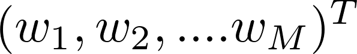
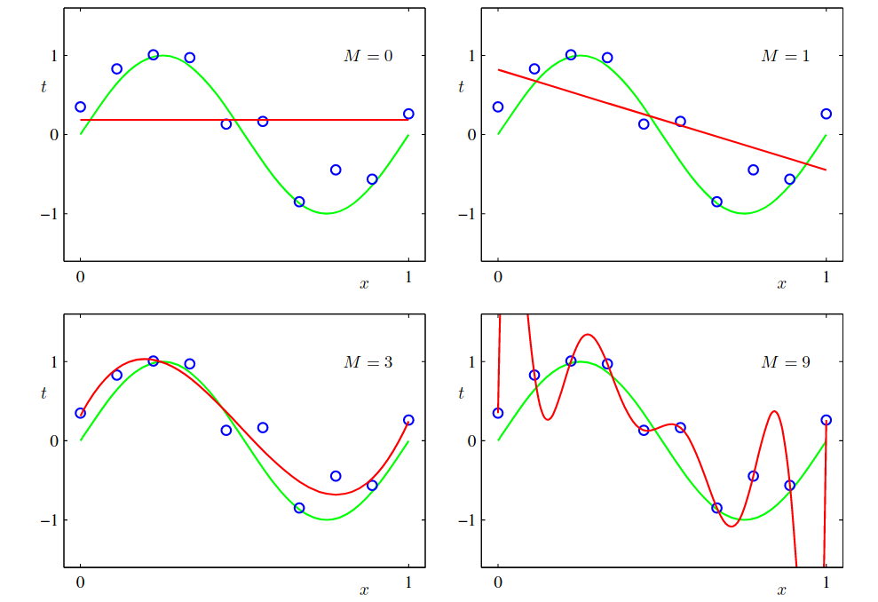

# 1.1. Example: Polynomial Curve Fitting

In the previous example our goal is to predict the value of t for some new value of x, without knowledge of the green curve.

Let's start by introducing a simple regression problem

We have a training set comprising of N observations of $$x $$ written as $$\mathbf{x} \equiv\left(x_{1}, \ldots, x_{N}\right)^{T},$$ with corresponding target values t, denoted as $$\mathbf{t} \equiv\left(t_{1}, \ldots, t_{N}\right)^{\mathrm{T}}$$.

Our goal is to exploit this training set in order to make predictions predictions $$\widehat{t}$$ for some new value $$\widehat{x}$$ of the input variable. That  involves implicitly to discover the  underlying function $$sin(2\pi x)$$.

* We shall informally consider a simple approach based curve fitting. Therefore, we fit the  data using a polynomial function of the form

$$
y(x, \mathbf{w})=w_{0}+w_{1} x+w_{2} x^{2}+\ldots+w_{M} x^{M}=\sum_{i=0}^{M} w_{j} x^{j}
$$

where $$M$$ is the order of polynomial, and $$x^j$$ denotes $$x$$ raised to the power $$j$$.

The sum of the squares of the errors between the predictions $$y\left(x_{n}, \mathbf{w}\right)$$  _for each data point_ $$x_{n}$$ and the corresponding target values  $$t_{n},$$ so that we minimize

$$
E(\mathbf{w})=\frac{1}{2} \sum_{n=1}^{N}\left\{y\left(x_{n}, \mathbf{w}\right)-t_{n}\right\}^{2}
$$

## Which polynomial should we choose

* Split your data \(randomly\) into non-overlapping **training sets** and **testing sets.**
* Fit parameters on training set.
* Test quality of the model by testing how well it fits on the test-set.
* K-Fold cross validation: Repeat this procedure K times such that every data point appears exactly one in the test-set.
* Cross-validation gives an estimate of the generalization error.

