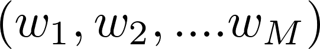
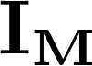
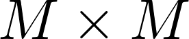
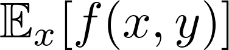
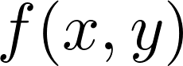
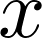
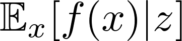
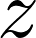
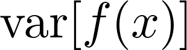
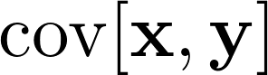

# Mathematical Notations

  $$\mathbf{X}$$ – Denotes a column vector

 $$\mathbf{X^T}$$ - Denotes a row vector

  **M** - Denotes a matrix

 - Denotes a row vector with M elements

 -  Denotes a column vector with M elements

\[a, b\] - Denotes the closed interval from a to b, that is the interval including the values a, b themselves.

\(a, b\) – Denotes an open interval, that is the interval excluding a, b

\[a, b\) – An interval that includes a and excludes b

 - Denotes an identity matrix \(unit matrix\)

 - Denotes an expectation of a function with respect to a random variable

- Denotes conditional expectation if the distribution of is conditioned on another variable

 - Denotes the variance of a function

 - Denotes the covariance of the vector variable

