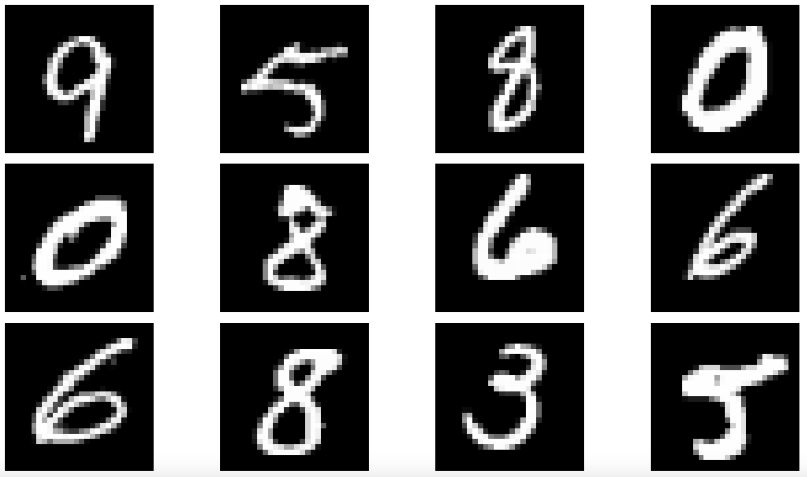
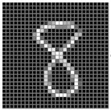

# Motivation

Consider an example of recognizing hand written digits illustrated below

* Each digit corresponds to a 28\*28 pixel image 

* A image an represented by a vector $$x$$ comprising 784 real numbers

**GOAL :** 

To build a machine that will take a vector $$x $$ \(  \) as input and produce an output of the digit 0, **..** ,9

**Challenge :**

* Wide variability of handwriting .- We can handle it by rules for distinguishing the digits based on shape of the strokes
* Handling rules for distinguishing digits approach can lead to increase of rules and of exceptions to the rules and so on. Thus resulting in poor results.

**Solution :**

* Adopting a machine learning approach

  * A large set of $$N$$ digits $$\left\{\mathbf{x}_{1}, \dots, \mathbf{x}_{N}\right\}$$ called a **training set**
  * The labels \(categories\) of the digits in the training set are known in advance
  * The labels of the digit can be expressed as **target vector** $$\mathbf{t}$$ 

#### Example 

| $$\left\{\mathbf{x}_{1}, \dots, \mathbf{x}_{N}\right\}$$  | col-1 | col-1 | col-2 | col-m | target-digit |
| :--- | :--- | :--- | :--- | :--- | :--- |
| $$\mathbf{x_1}$$  | 0.2 | 0.1 | 0.8           ....... | 0.001 | 9 |
| $$\mathbf{x_2}$$  | 0.0001 | 0.000001 | 0.6           ....... | 0.001 | 1 |
| $$\mathbf{x_3}$$  | 0.1 | 0.3 | 0.2           ....... | 0.9 | 6 |
| ... | **...** | **...** | **...** | **...** | **...** |
| $$\mathbf{x_N}$$  | **...** | **...** | **...** | **...** | **...** |

* The machine learning algorithm can be expressed as a function $$\mathbf{y}(\mathbf{x})$$ which takes a new digit image  $$\mathbf{x} $$ as input and that generates an output vector $$\mathbf{y},$$encoded similar to the target vector.

### **Phases of machine learning approach**

**Preprocessing \(Feature-extraction\)**

* For practical applications, the original input variables $$\left\{\mathbf{x}_{1}, \dots, \mathbf{x}_{N}\right\}$$ are typically preprocessed to transform them into a new variable space.
* For example, in the digit recognition problem, the images of the digits are typically translated and scaled so that each digit is contained within a box of fixed of size.
* This reduces the variability within each digit images.
* Can also help us to speed up computation 
  * Example : **FaceID on IPhone**
    * The goal is to detect  real time face detection. The IPhone must handle huge number of pixels and present it to a complex pattern recognition algorithm may be computationally infeasible.
  * Solution **:**
    * To find useful features that are fast to compute, and also preserve useful information enabling to distinguish the right face.

**Training**

* The precise form of the function $$\mathbf{y}(\mathbf{x})$$ is determined during the training phase \(learning phase\) on the training data.

**Testing**

* Once the model is trained it can then applied to a **test set** \(different from training dataset\) to identify new digits images \(target of the test set\).
* The ability to label test set target correctly is known as **generalization.**

### **Types of machine learning algorithms**

#### Supervised Learning

* An input vector $$\mathbf{x}$$ with their corresponding target vectors $$\mathbf{y}$$ are know as **supervised learning problems.**
  * Problems such as digit recognition, in which the aim  is to assign each input vector to a finite number of discrete categories \(classes\), are called **classification problems.**
  * If the problem is to predict one or more continuous variables, then the task is **regression**. Examples include age prediction, stock prediction, house rent prediction etc.,

#### Unsupervised Learning

* An input vector $$\mathbf{x}$$ \(training data\) without any corresponding target vector are know as **unsupervised learning**

  * The goal of unsupervised learning is to discover groups of similar structure or similarity within the data, where it is called as **clustering.**

  \*\*\*\*

#### Reinforcement Learning

* The problem of finding suitable actions to take in a given situation in order maximize a reward.
  * Example : Chess game
    * if you make a right move, will get +ve reward.
    * Wrong move, will give -ve reward.

