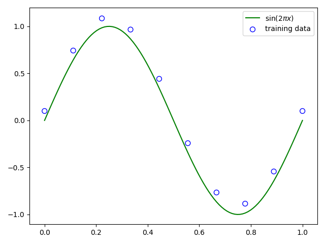

# Example Data

Plot of a training data set of N = 10 points, shown as blue circles, each comprising an observation of the input variable x along with the corresponding target variable t. The green curve shows the function $$sin(2\pi x)$$ used to generate the data. Our goal is to predict the value of t for some new value of x, without knowledge of the green curve.



#### Python code to run the above example

```text
# python libraries

import numpy as np
import matplotlib.pyplot as plt

# Function to create training set of N = 10 points 

def dummy_data(func, sample_size, noise):
    x = np.linespace(0, 1, sample_size)
    t = func(x) + noise
    return x, t

# sin(2πx) function

def sin_func(x):
    return np.sin(2*np.pi*x)

# creating training set with target set
train, target = dummy_data(sin_func, 10, 0.1)

# creating test set
test = np.linespace(0,1,100)

# target of the test
target_test = func(test)

# plotting 
plt.scatter(train, target, facecolor="none", edgecolor="b", s=50, label="training data")
plt.plot(x_test, y_test, c="g", label="$\sin(2\pi x)$")
plt.legend()
plt.show()
```


